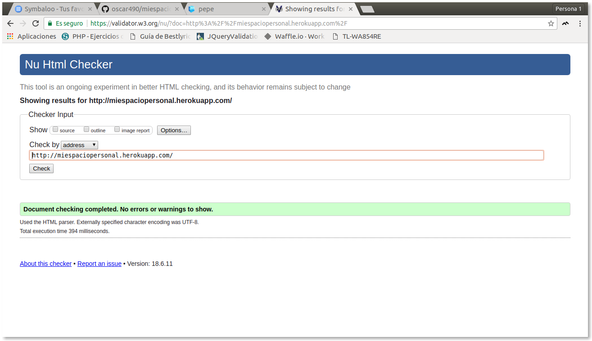
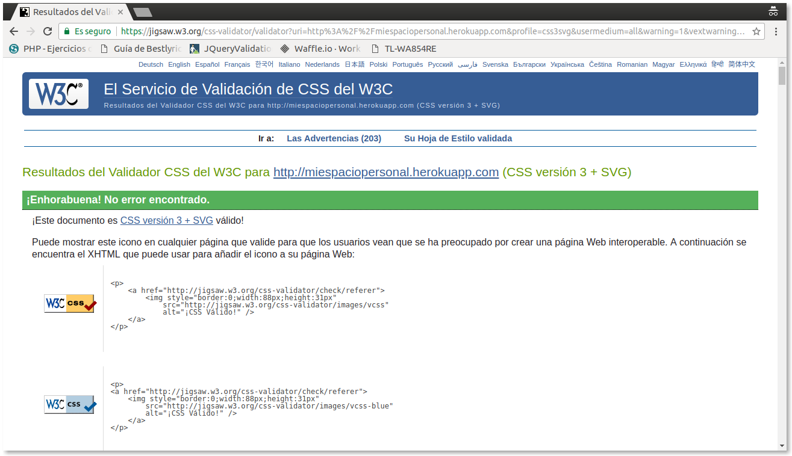
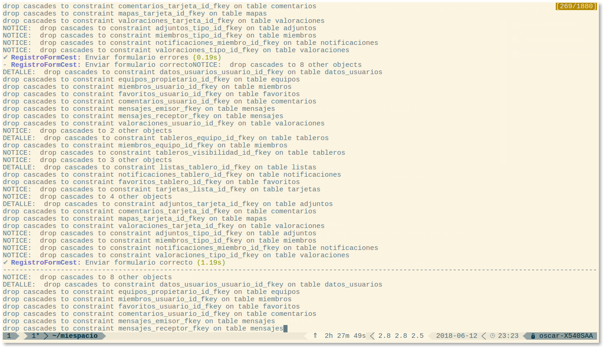

# Anexos

Validaciones de codigo
---
    

** Validación del código HTML**
  

   

** Validación del estilo CSS3 **
  

   

** Validación del nivel de accesibilidad AA **
  

    

Prueba del seis
---

    

** ¿Qué sitio es este? (identificador del sistio)**
  
Se trata del sitio web de la aplicación MiEspacio, destinado a toda clase de usuarios.
  

El logotipo y el nombre del sitio está presente en todas las páginas del sitio, por lo que la web está identificada en todo momento.
   

** ¿En qué página estoy? (Nombre de la página) **
  

En la web se puede contemplar en que sección nos encontramos mediante un menú que nos indica en que sección nos encontramos, ya que se resalta de otro color diferente.
    

** ¿Cuáles son las principales secciones del sitio? (Secciones)? **
  

Las principales secciones se encuentra en un menú básico, el cual puede acceder un usuario logueado a cada una de ellas.
    

** ¿Qué opciones tengo en este nivel? (Navegación local) **
  

La navegación local se realiza mediante enlaces. En el contenido de un tablero, se encuentra un enlace al contenido del equipo al que pertenece. Y desde el contenido del equipo, contiene enlaces a los tableros que contiene.
    

** ¿Dónde estoy en el esquema de las cosas? (Indicaciones de "Usted está aquí") **
  

La web dispone de "las migas de pan" para tener informado al usuario en donde se encuentra.
    

** ¿Cómo busco algo? (Buscador) **
  

Dentro de la web dispone de un buscador, de manera que pueda buscar, en todo momento, los tableros que tiene creado.
    

Navegadores
--
   

** Google Chrome **
  

   

** Mozilla Firefox **
  

   

** Microsoft Edge **
  

   

** Opera **
  

   

Pruebas
---
 

Ejecución de pruebas funcionales:

