# Manual de usuario

Manual báscio de usuario sobre la aplicación MiEspacio.

Registrarse
-----------
 

Para registrarnos en la aplicación, debemos seleccionar la opción "Registrarse".
  

  
Nos redireccionará al formulario de registro, se sebe rellenar por completo.

 
 
 

Iniciar sesión
--------
 

  
Seleccionamos la opción de "Iniciar sesión", una vez dentro, escribimos los datos necesarios para inciciar sesión.
 

Una vez iniciada la sesión, accederemos a la página principal donde se muestra todos los Tableros que tenemos creados y los Equipo a los que petenecen.

   

Cerrar sesión
----
 

  
Una vez que estemos en la sesión, desde la selección de la imagen de usuario, podemos seleccionar la opción de "Cerrar sesión". De esa manera cerramos nuestra sesión.

   

Perfil de Usuario
----
 

  
Una vez que estemos en la sesión, desde la selección de la imagen de usuario, podemos seleccionar la opción de "Perfil". De esa manera accedemos al perfil de nuestro usuario.

   

Modificar perfil de Usuario
----
 

 

  
Desde el perfil del usuario, podemos modificar tantos los datos de perfil, como los datos de la cuenta.

   

Recuperar contraseña
----
 

 

En la página de inicio de sesión, seleccionamos "¿Has olvidado la contraseña?" y nos redireccionará a una página que contiene un formulario donde indicaremos la dirección de correo donde se enviara un enlace para recuperar la contraseña.

Cuando pulsemos el enlace, que esta en el correo, nos redireccionará a una página que contiene un formulario para establecer la nueva contraseña.

   

Crear y modificar un Equipo
----
 

Desde la página principal, seleccionamos la opción de "Crear equipo".
 

Nos parecerá un formulario para crear el equipo. Escribimos los datos necesarios para crear el equipo.
 

Cuando se cree el nuevo equipo, accederemos a la vista de su contenido.
 

Desde la página principal, al seleccionar el nombre del equipo, podemos acceder a su contenido.
 

Desde la selección "Configuración" podemos modificar los datos del equipo.
 

Desde la selección "Imagen" podemos modificar la imagen del equipo.

   

Eliminar un equipo
---
 

Desde la selección "¿Eliminar este equipo?" podemos eliminar un equipo, que haya sido creado, preguntándonos si queremos realmente eliminarlo.

   

Crear y modificar un Tablero
---
 

En la página principal, o en el contenido de un equipo, al seleccionar "Crear un tablero nuevo", se abrirá un fomrulario para crear un nuevo tablero en ese equipo, indicando el nombre que tendrá.
 

Al crearlo, accederemos al contenido de ese tablero creado.
 

Desde la página principal, podemos acceder al contenido de un tablero, seleccionando su nombre, que estña contenido en un rectángulo.

Desde el contenido del tablero, seleccinado sobre "Propiedades", se abrirá un un menú para modificar los datos del tablero o cambiar a que equipo pertenecerá.

   

Eliminar un tablero
---
 

Desde la selección "Eliminar" podemos eliminar un tablero, que haya sido creado, preguntándonos si queremos realmente eliminarlo.

   

Crear y modificar una Lista
---
 

Desde el contenido del tablero, al seleccionar "Crear lista", se mostrará un menú para crear una lista, que contendrá las tarjetas.
 

Una vez creada, se mostrará en el contenido del tablero dicha lista.
 

Desde el botón, se abrirá un campo de texto para modificar el nombre de la lista.

   

Eliminar una lista
---
 

Desde el botón "X", se puede seleccionar para eliminar una lista.
 

Al seleccionarlo, aparecera un menú preguntándonos si queremos eliminarlo o no.

   

Crear y modificar una Tarjeta
---
 

Desde el botón "+", aparecerá un formulario para crear una nueva tarjeta, indicando el nombre que tendrá.
 

 

Dentro de la lista, aparecerá las tarjetas creadas. Y desde el botón, con símbolo de un "ojo", podemos acceder al contenido de esa tarjeta.
 

Desde el contenido de una tarjeta, podemos modificar los datos de esa tarjeta, como el nombre o la descripción, seleccionando "Descripción".

   

Eliminar una tarjeta
---
 

Desde la vista de las tarjetas, cada una tiene una selección "X" para poder eliminarla.
 

Una vez seleccionado, nos preguntará si queremos o no eliminarla.

   

Añadir y modificar Adjuntos en la tarjeta
---

 

Desde el contenido de la tarjeta, podemos añadir adjuntos, ya sea una dirección de enlace, como una imágen o cualquier archivo.
 

Adjunto de un archivo.
 

Una vez adjuntado un archivo, se muestra una lista de tus archivos adjuntados.
 

A la hora de ver el adjunto añadido, si es una imágen, se muestra en la misma tarjeta. Para ver un adjunto se seleccionar el botón de un "ojo".
 

Si el adjunto es una dirección de enlace, nos abrirá una nueva pestaña con esa dirección.
 

Si el adjunto es un archivo, nos abrirá una pestaña con el contenido de ese archivo.
 

Al seleccionar el botón, se muestra un formulario para modificar el nombre del adjunto.

   

Eliminar un adjunto
---
 

 

Al seleccionar el botón de "X", se mostrará un menú preguntándonos si queremos eliminar el adjunto de la tarjeta.

   

Añadir y modificar comentarios en la tarjeta
---

 

Desde la selección de "Comentarios" podemos añadir un nuevo comentario.
 

Al añadir un nuevo comentario, podemos ver los comentarios nuestros y de otros usuarios miembros.
 

Desde la selección "Modificar", podemos modificar un comentario que hayamos añadido anteriormente, siendo nuestro comentario.

   

Eliminar un comentario de la tarjeta
---
 

Desde la selección de "Eliminar", podemos eliminar los comentarios que nosotos hayamos añadidos. No de otros usuarios.

   

Valorar una tarjeta
---

 

Desde "Adjuntos", podemos añadir una valoracióbn sobre la tarjeta.
 

En "Valoraciones", podemos ver las valoraciones que han realizado los usuarios sobre la tarjeta.

   

Ocultar y mostrar una tarjeta
---
 

Desde el contenido de la tarjeta, podemos seleccionar la opción de "Ocultar", para que la tarjeta no se muestre a los usuarios miembros del equipo.
 

También podemos seleccionae "Mostrar", si está oculta previamente, para que se vuelva a mostrar a los demás usuarios miembros.

   

Añadir miembros a un equipo
---
 

Desde el contenido del equipo, en la selección de "Miembros", se permite añadir a otros usuarios, registrados, para que formen parte del equipo y puedan ver todo su contenido (tableros, tarjetas, etc.), y añadir más elementos. Se debe buscar al usuario, su nombre. Se muestran los usuarios que pertenecen al equipo.
 

Una vez buscado el usuario, se debe pulsar el botón "Invitar" y se añade el usuario como miembro del equipo.
 

Una vez que se añade, ese usuario forma parte del equipo.

Notificaciones
---
 

 

Cuando un usuario nos añade, como miembro, en un equipo, nos llega una notificación informándonos que nos han añadido a un equipo.

   

Ocultar y mostrar un tablero
---
 

Desde el contenido de un tablero, podemos ocultar un tablero, de forma que los usuarios miembros del equipo no podrán acceder  a él. No tiene permiso. Desde la opción "Privado".
 

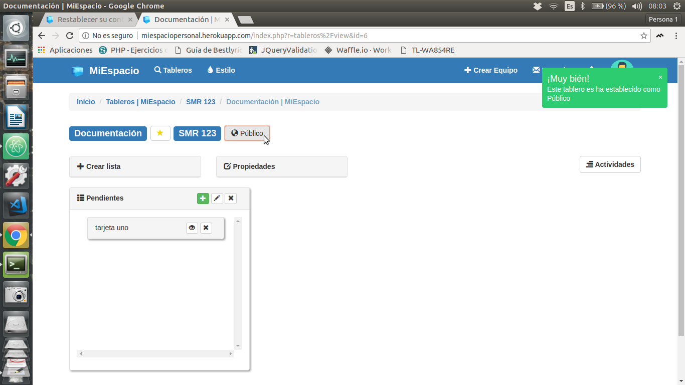

De igual forma, podemos volver a mostrar el tablero, para que puedan volver acceder a él. Si tendrían permisos. Desde la opción "Público".

   

Actividades de un tablero
---

 

Desde el contenido del tablero, en la selección de "Actividades", se podrá acceder a una lista de acciones que se han realizado sobre el tablero.

   

Establecer estilo
---
 

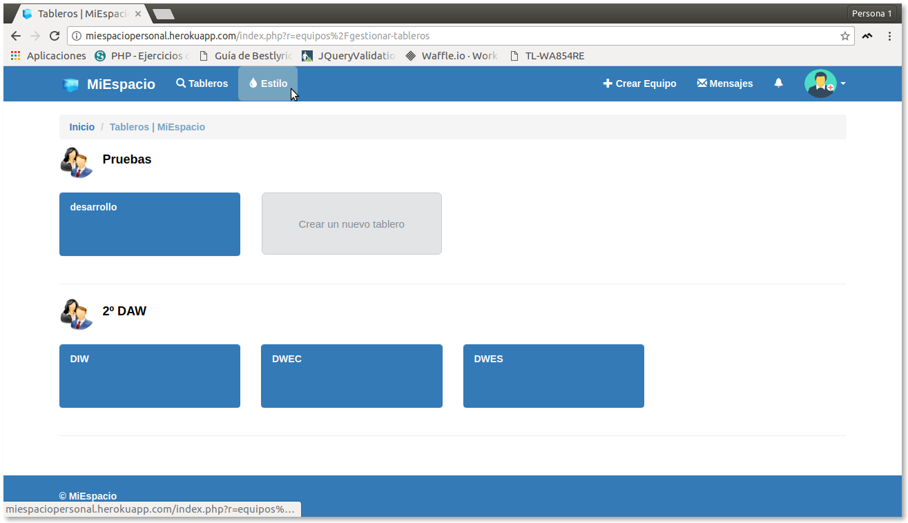
 

Desde la selección "Estilos", se puede elegir y cambiar el color de varios elementos de la aplicación, como la cabecera, tableros, pie de página, etc.

   

Buscar Tableros
---
 

 

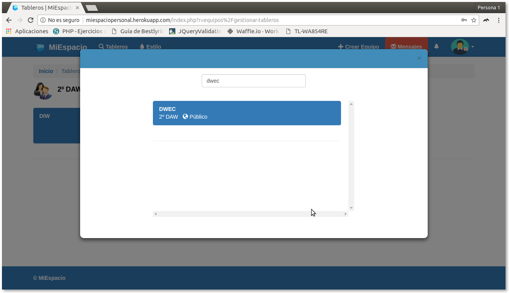

Desde la selección "Tableros" se permite buscar un tablero dado su nombre.
 

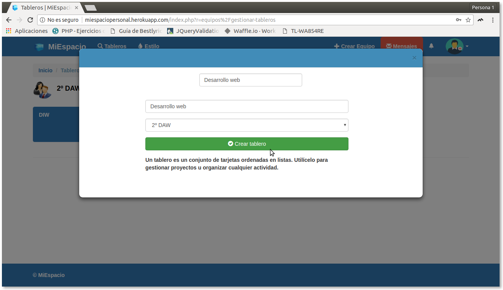

En caso de que no exista el tablero a buscar, se puede crear un nuevo tablero desde el formulario de búsqueda.

   

Enviar y recibir mensajes
---
 

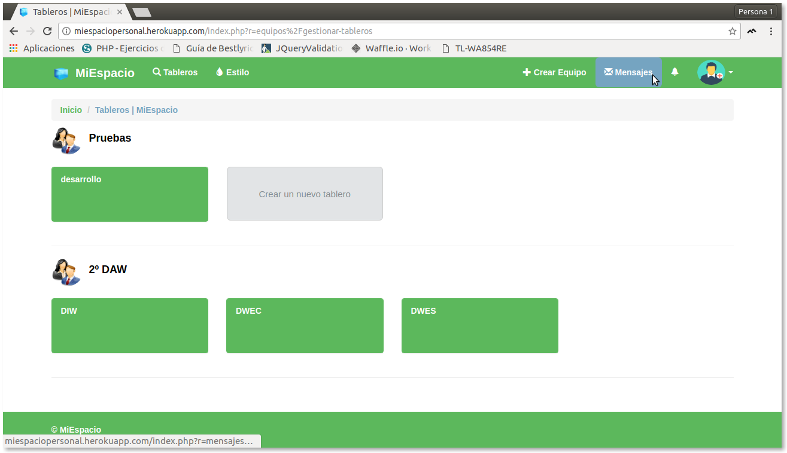
 

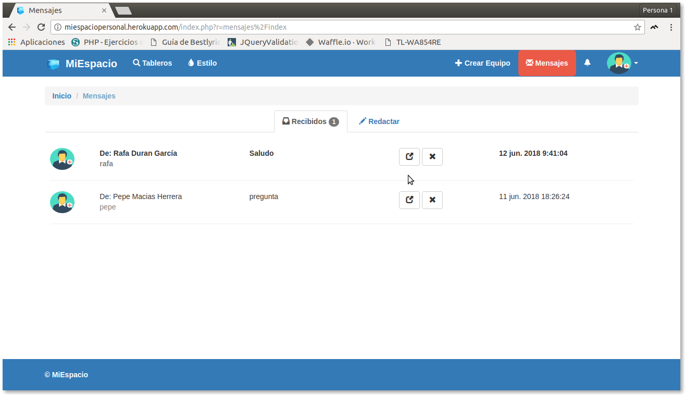

Desde la opción "Mensajes", podemos acceder a la lista de mensajes recibidos por otro usuarios.
 

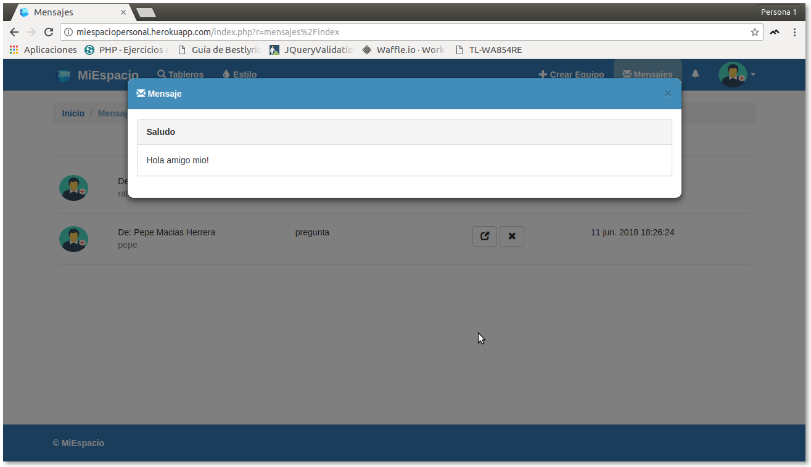

Al seleccionar el botón de expandir, podmeos ver el contenido de dicho mensaje.
 

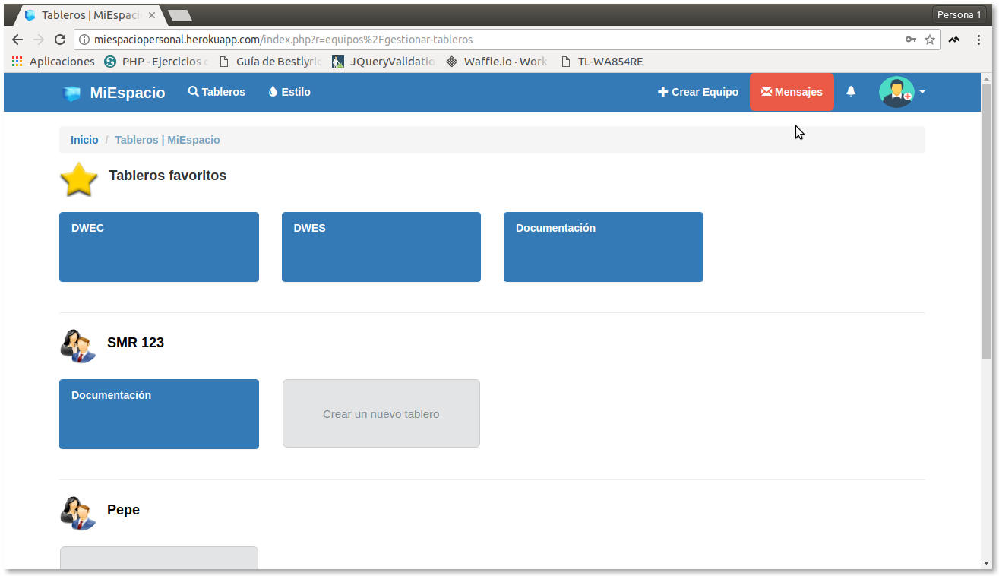

Cuando recibimos un nuevo mensaje, se nos avisará desde la sección de "Mensajes".

   

Enviar y eliminar mensajes
---
 

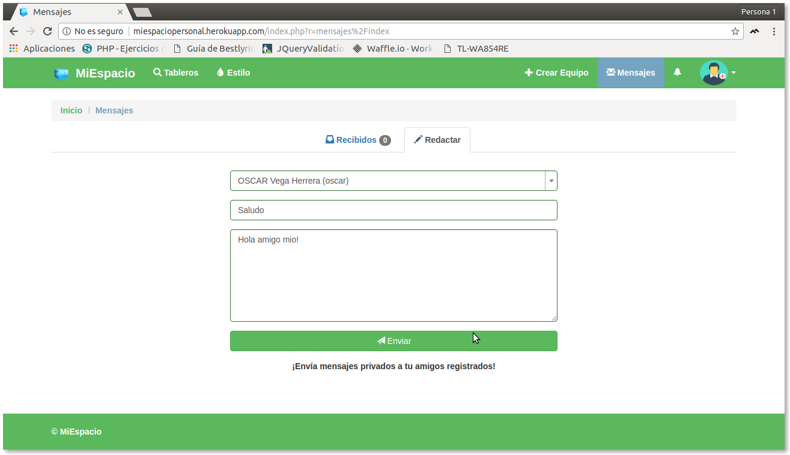

Desde el contenido de "Mensajes", a partir de la selección "Redactar", podemos escribir un nuevo mensaje para enviar a un usuario, se debe indicar el nombre del usuario, un asunto y el contenido.
 

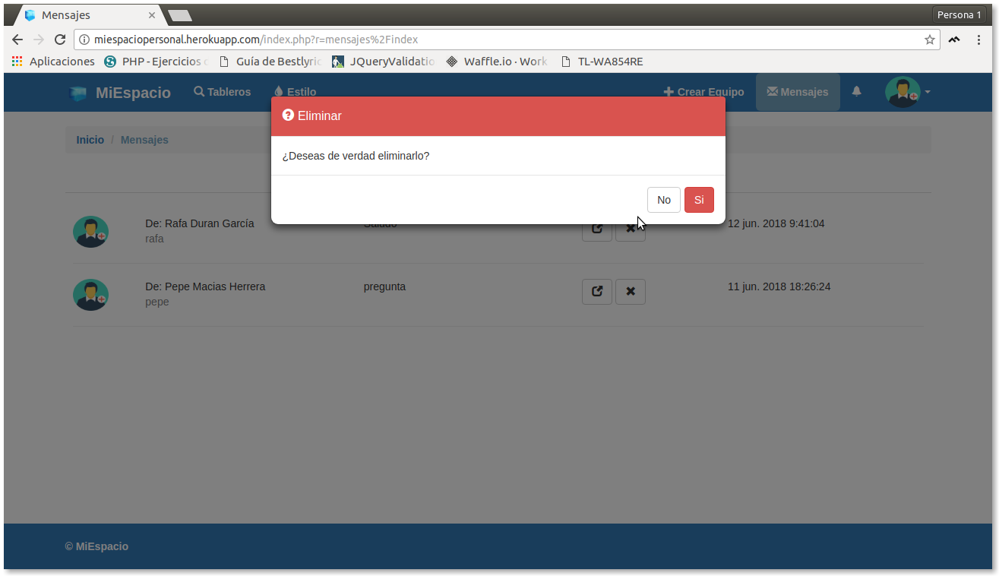

También se puede eliminar los mensajes recibidos, desde la selección "X". Nos preguntará si queremos eliminarlo.

   

Añadir y modifcar ubicaciones
---

 

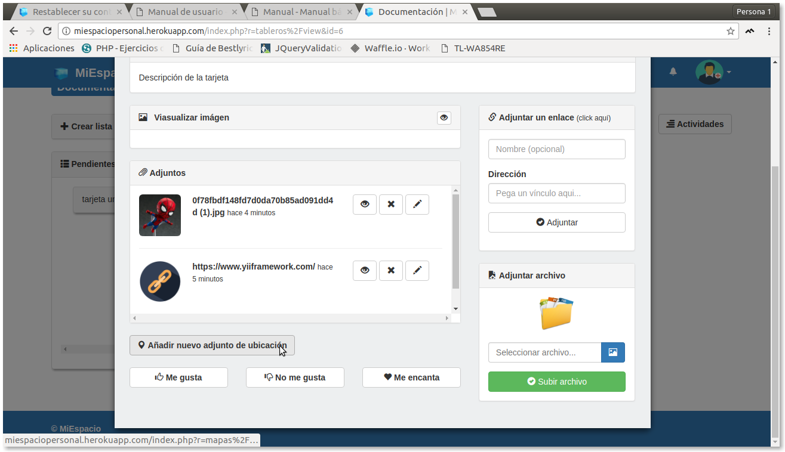
 

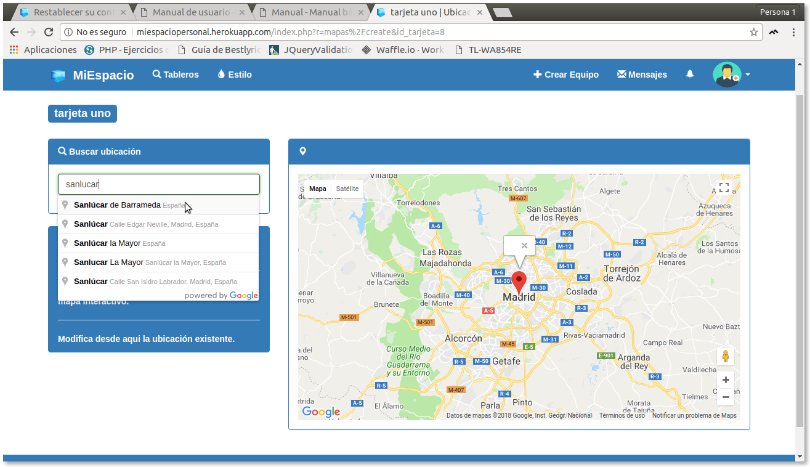

Desde el contenido de una tarjeta, podemos seleccionar "Añadir un nuevo adjunto de ubicación", de manera que accederemos a un formulario para introducir el nombre de una ubicación y lo podremos adjuntar un mapa, con esa ubicación, en la tarjeta.
 

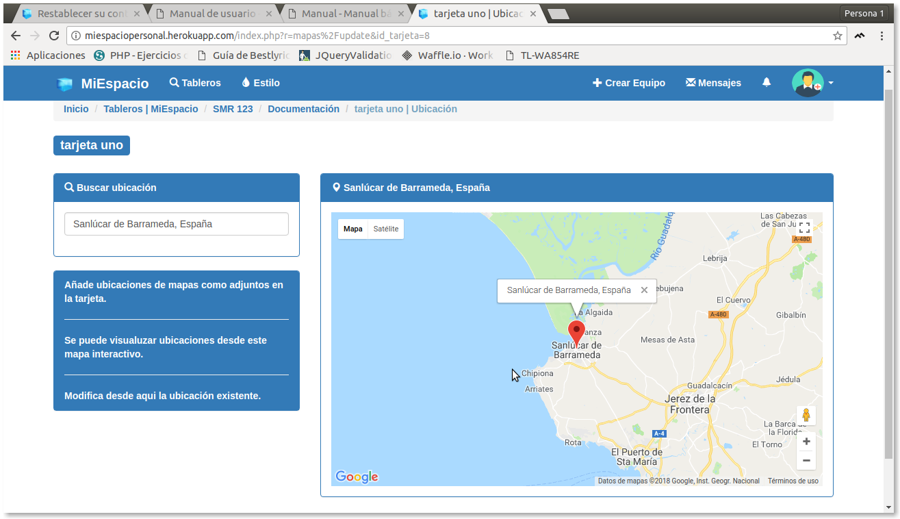

Tambien podemos modificar una ubicación que ya se encuentra añadida en una tarjeta.
